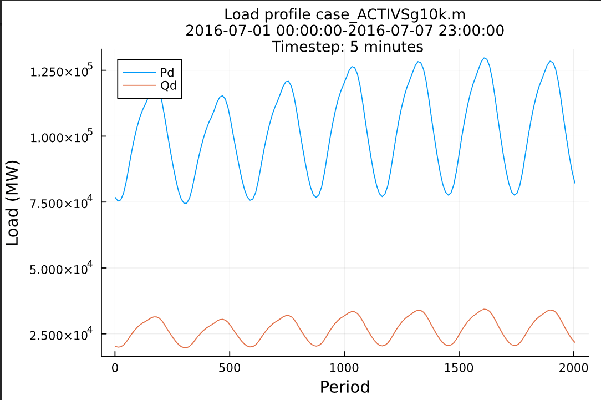

# Milepost 7

[![][build-stable-img]][build-url]

Milepost 7 is an application of the ECP ExaSGD project to solve multiperiod security-constrained optimal power flow (MPSCOPF) at a large-scale on GPU
architectures.

## Dependencies
Milepost 7 depends on the following packages:
- [ProxAL.jl](https://github.com/exanauts/ProxAL.jl)
- [ExaAdmm.jl](https://github.com/exanauts/ExaAdmm.jl)
- [ExaPF.jl](https://github.com/exanauts/ExaPF.jl)

## Installation
These packages and sub-dependencies will be pulled automatically when installing
Milepost 7. To instantiate all the submodules, run the following command:
```julia
] up
```
Manifest files for Polaris (ALCF), Summit (OLCF), and Frontier (OLCF) are
provided that have been used to run on these systems.

## Quickstart
To run Milepost 7, run the following command:

```bash
$ julia --project main.jl
required argument case was not provided
usage: main.jl [--profile] [--rhopq RHOPQ] [--rhova RHOVA]
               [--configuration CONFIGURATION]
               [--proxal_iter PROXAL_ITER]
               [--exatron_inner_iter EXATRON_INNER_ITER]
               [--exatron_outer_iter EXATRON_OUTER_ITER] case load T K
```
* `case` is the case file to use
* `load` is the load files to use
* `T` is the number of periods taken from the `load.Pd` and `load.Qd` files
* `K` is the number of contingencies taken from the `case.Cg` file
* `--configuration` is the configuration of the block solver in ProxAL given as an integer
  * 1: use JuMP and Ipopt,
  * 2: use ExaAdmm/ExaTron on CPU,
  * 3: use ExaAdmm/ExaTron on GPU with CUDA,
  * 4: use ExaAdmm/ExaTron on GPU with [KernelAbstractions.jl](https://github.com/JuliaGPU/KernelAbstractions.jl), targeting either NVIDIA, AMD, or Intel GPUs, depending on the detected hardware.
* `--profile` enables profiling of the code using [PProf.jl](https://github.com/JuliaPerf/PProf.jl)
* `--rhopq` is the ADMM penalty parameter for `pq`
* `--rhova` is the ADMM penalty parameter for `va`
* `--proxal_iter` is the maximum number of ProxAL iterations
* `--exatron_inner_iter` is the maximum number of ExaTron inner iterations
* `--exatron_outer_iter` is the maximum number of ExaTron outer iterations

### Example
To run Milepost 7 on the ACTIVSg10k case with 4 MPI ranks, 2 periods, 1
contingency, amounting to 4 blocks, using the GPUs and KernelAbstractions.jl, with 500 ProxAL iterations, 400 ExaTron inner iterations, and 1 ExaTron outer iteration, with profiling enabled, run the following command:
```bash
./mpiexecjl --project -n 4 julia --project main.jl cases/case_ACTIVSg10k.m cases/case_ACTIVSg10k 2 1 --configuration 4 --proxal_iter 500 --rhopq 3e3 --rhova 3e4 --exatron_inner_iter 400 --exatron_outer_iter 1 --profile
```
We assume that each MPI rank is associated to one GPU. This will assign one block problem to each GPU. Note that multiple block problems can be assigned to a single GPU. In this case, the GPU will solve the block problems sequentially.

## Data format
### Contingencies
Milepost 7 supports N-x contingencies, though no convergence is guaranteed in
this case. The format for the contingencies is (lines, columns) =
(contingencies, lines).

### Load data
Load data is stored in two files for the P and Q load, respectively. The format
is (lines, columns) = (buses, periods).

The load data for the ACTIVSg2000 and ACTIVSg10k case have been generated by
NREL and provided in CSV format. To convert these load files into the format
used by Milepost 7, run the following command in the `cases` directory
environment:
```bash
julia --project pdqdfromcsv.jl --help
usage: pdqdfromcsv.jl [--plot] [-h] case Pd Qd

positional arguments:
  case        Case file
  Pd          Pd load file
  Qd          Qd load file

optional arguments:
  --plot      Create a plot of the load
  -h, --help  show this help message and exit
```

Here is the plot of the load for the `ACTIVSg10k` case as defined in `ACTIVSg10k.Pd` and `ACTIVSg10.Qd`.



## Funding
This research was supported by the Exascale Computing Project (17-SC-20-SC), a joint project of the U.S. Department of Energy’s Office of Science and National Nuclear Security Administration, responsible for delivering a capable exascale ecosystem, including software, applications, and hardware technology, to support the nation’s exascale computing imperative.

[build-url]: https://github.com/exanauts/Milepost7.jl/actions?query=workflow
[build-stable-img]: https://github.com/exanauts/Milepost7.jl/workflows/CI/badge.svg?branch=main
